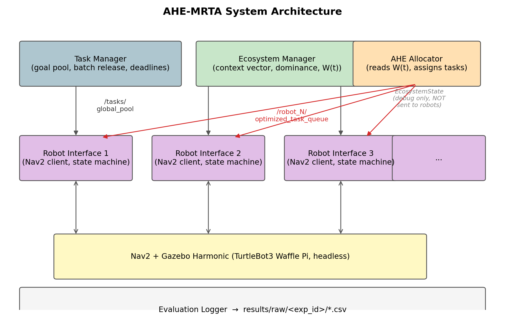
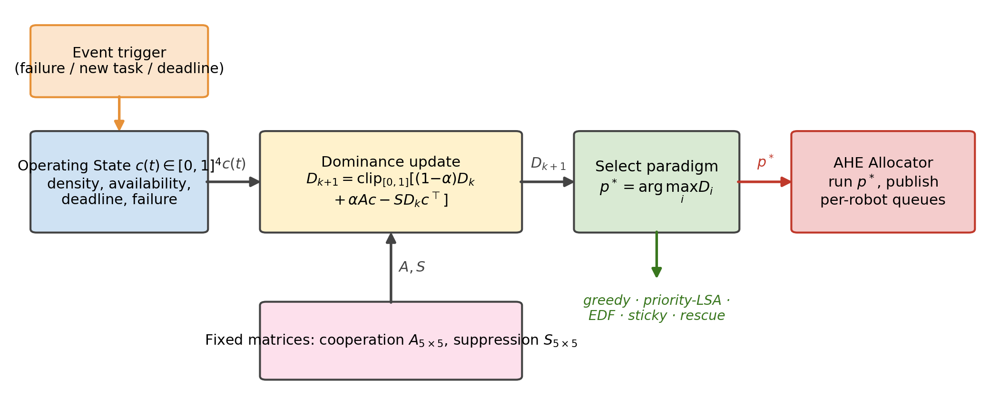
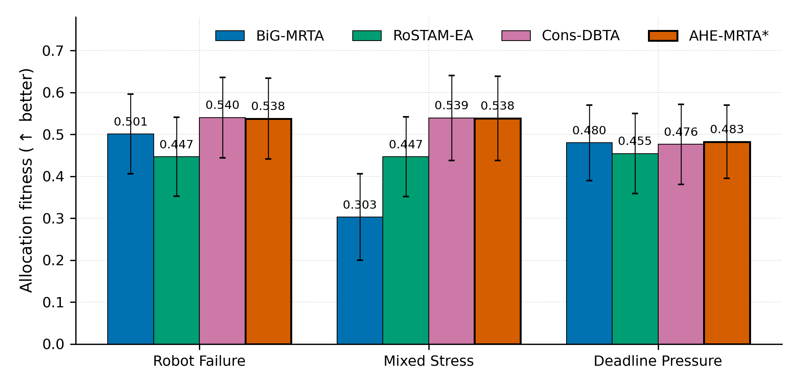
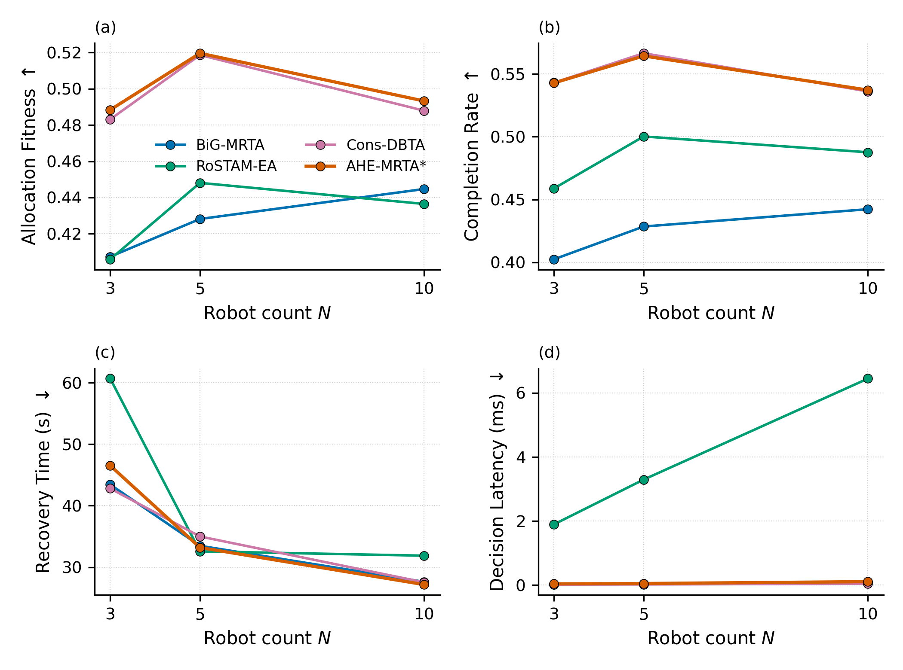
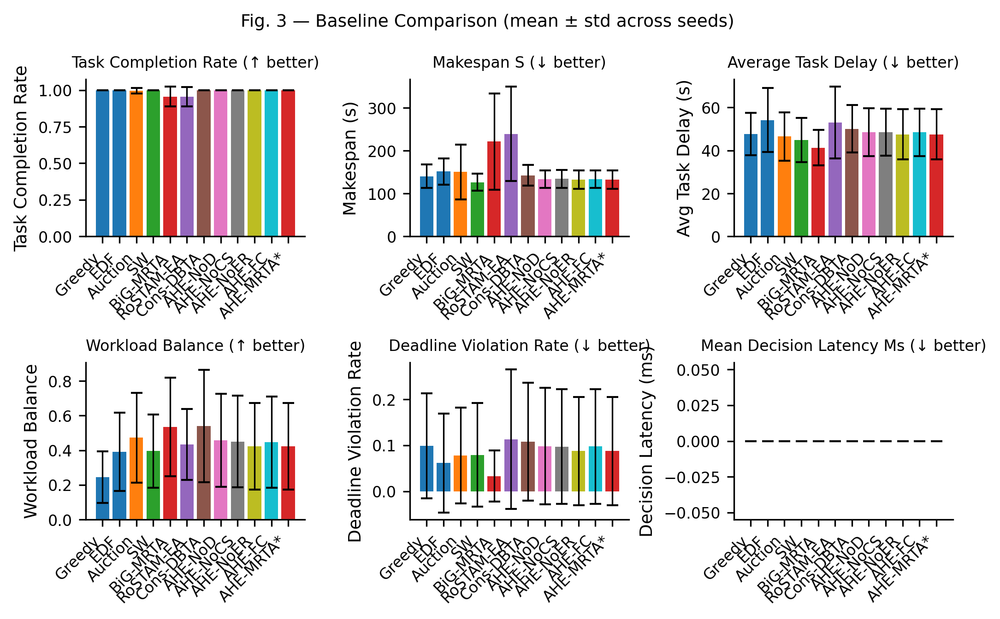
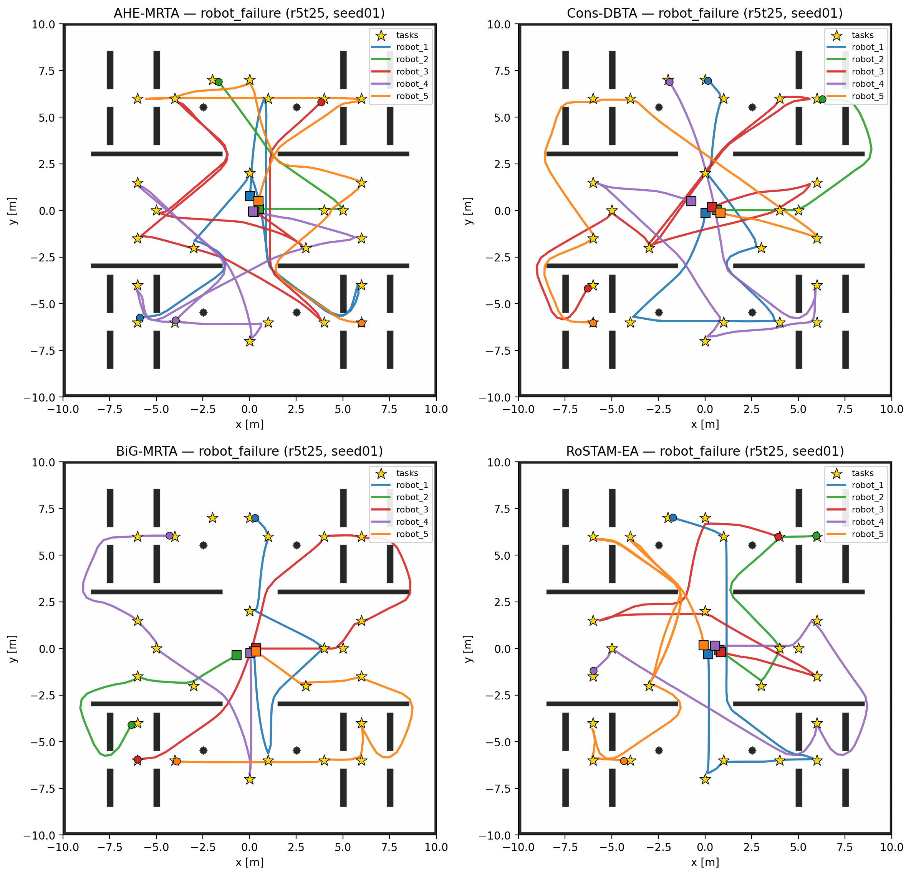
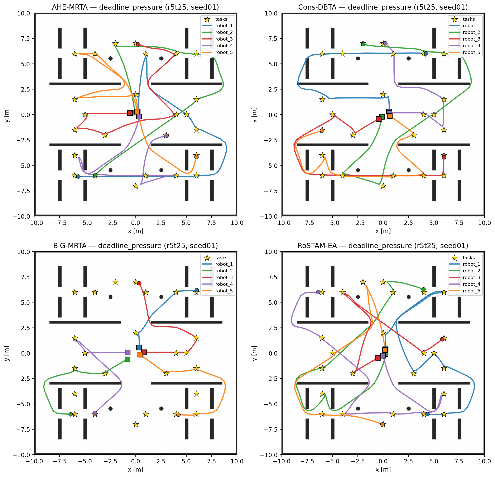
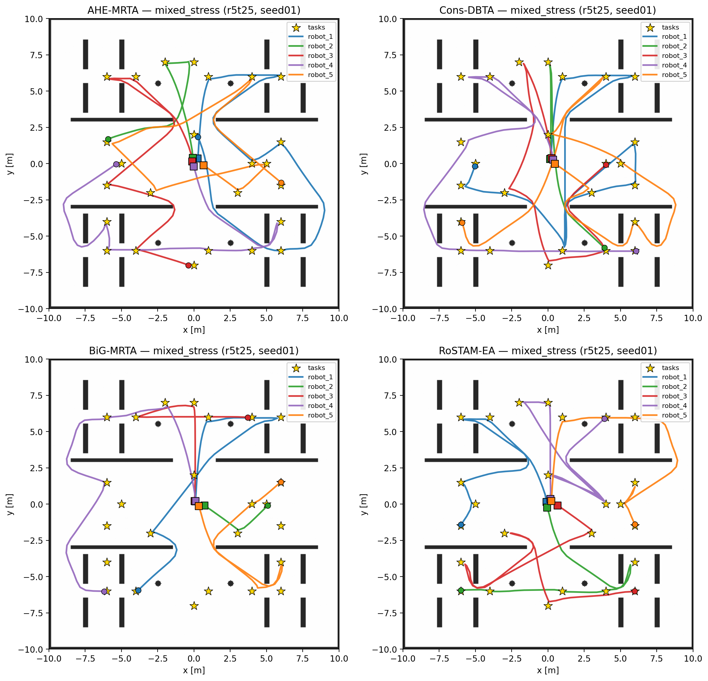

# AHE-MRTA — Adaptive Heuristic Ecosystem for Online Multi-Robot Task Allocation

Online multi-robot task allocation (MRTA) under **robot failures**, **mixed stress**, and
**deadline pressure**, evaluated on a full **ROS 2 Jazzy + Gazebo Harmonic + Nav2** stack with
TurtleBot3 robots.

AHE-MRTA does **not** commit to a single allocation paradigm. It is a **selection
hyper-heuristic**: at every allocation event a biomimetic *ecosystem* chooses, online, which of
five classical allocation primitives to apply, driven by a 4-dimensional context vector and a
Lotka–Volterra dominance dynamic. We call this **Ecosystem-Driven Paradigm Selection (EDPS)**.

> **Honest standing (read this first).** This project follows a strict *report-what-the-data-says*
> policy. The headline is deliberately modest and evidence-backed:
> - **Plane A (navigation-free allocation fitness):** AHE-MRTA and the strongest consensus baseline
>   are **statistical co-leaders** — under idealized perfect navigation *every* method reaches
>   fitness ≈ 1.0, so allocation quality is **saturated** and does not differentiate the top methods.
> - **Plane B (physical Nav2 stack):** AHE-MRTA is the **best method** vs. three recent baselines —
>   highest completion (CR = 1.000/0.996 at 5r/10r under robot failure), lowest deadline-violation
>   rate among full-completers, and sub-millisecond decision latency (~125–280× faster than the
>   evolutionary baseline).
>
> A rigorous headroom/ablation analysis (see [Findings](#9-findings--limitations)) shows there is no
> realizable allocation-layer improvement: the binding constraint is **navigation**, not allocation.

---

## Table of Contents
1. [Key Idea & Contributions](#1-key-idea--contributions)
2. [Methodology (full mathematical formulation)](#2-methodology-full-mathematical-formulation)
3. [System Architecture](#3-system-architecture)
4. [Two-Plane Experimental Design](#4-two-plane-experimental-design)
5. [Reproduction Pipeline (end-to-end)](#5-reproduction-pipeline-end-to-end)
6. [Results](#6-results)
7. [Path Plans (qualitative trajectories)](#7-path-plans-qualitative-trajectories)
8. [Repository Structure](#8-repository-structure)
9. [Findings & Limitations](#9-findings--limitations)
10. [Build & Run](#10-build--run)
11. [Paper & Citation](#11-paper--citation)

---

## 1. Key Idea & Contributions

Each existing online MRTA solver commits to one paradigm and trades one strength for one weakness
(market/auction: fast but re-bidding cost; matching/programming: high quality but poor re-planning
scaling; consensus/bundle: stable but slow to adapt; evolutionary/learning: rich search but slow to
react). **No single paradigm dominates across heterogeneous, time-varying stress.**

**Contributions**

1. **EDPS** — an online paradigm-switching MRTA framework: 5 biomimetic hormones map to 5 allocation
   mechanisms; selection is *two-tier* (fast deterministic context overrides for acute regimes +
   a Lotka–Volterra dominance dynamic for the rest). Fixed mapping, explainable, sub-millisecond.
2. **Nav2-independent allocation-fitness simulator** — isolates algorithmic decision quality from
   physical execution noise (100 seeds/scenario).
3. **Full Gazebo Harmonic + ROS 2 Jazzy + Nav2 validation** — 300 experiments × 3 scenarios × 3
   physical scales (3/5/10 robots), 4 methods, 9 metrics.
4. **Honest SIM→Gazebo transfer-gap analysis** — documents *where* paradigm switching helps and
   *where* physical execution erases its gains, with a quantitative headroom/ablation study.

---

## 2. Methodology (full mathematical formulation)

EDPS uses **5 hormones / 5 paradigms** and a **4-dimensional context vector**. (Earlier 7-hormone /
7-dimension variants were ablated away: the removed signals were inactive in every regime,
Δfitness ≈ 0.)

### 2.1 Problem formulation

Class (Gerkey–Matarić): **ST-SR-TA, time-extended, online dynamic arrival**.

- Robots $\mathcal{R}=\{r_1,\dots,r_n\}$; open tasks $\mathcal{T}(t)=\{\tau_1,\dots,\tau_{m(t)}\}$.
- Task $\tau = (p_\tau, d_\tau, \pi_\tau, c_\tau, a_\tau, s_\tau)$: position, deadline, priority
  $\pi_\tau\in\{1,2,3\}$, capability, activation time, service time.
- Robot state $x_r(t)=(p_r, b_r, \tau_r^{\mathrm{cur}}, \phi_r)$: pose, battery, current task,
  availability ($\phi_r\in\{\text{alive},\text{failed}\}$).
- Decision at each event $t_k$: $x_{r,\tau}(t_k)\in\{0,1\}$ with
  $\sum_\tau x_{r,\tau}\le Q$ (queue cap), $\sum_r x_{r,\tau}\le 1$, and capability feasibility
  $x_{r,\tau}=1\Rightarrow c_\tau\subseteq\mathrm{cap}(r)$.
- Objective over $[0,T_{\max}]$: completion rate ↑, deadline-violation rate ↓, delay ↓, makespan ↓,
  decision latency ↓.

### 2.2 Context vector (4-D)

$c(t_k)\in[0,1]^4$, with $\Delta_d=60$ s, $\mathcal{R}^{\mathrm{av}}$ available and
$\mathcal{R}^{\mathrm f}$ failed/stuck robots:

$$
c_1=\min\!\Big(1,\tfrac{m}{n}\Big),\quad
c_2=\tfrac{|\mathcal{R}^{\mathrm{av}}|}{n},\quad
c_3=\tfrac{|\{\tau:\,d_\tau-t_k\le\Delta_d\}|}{\max(1,m)},\quad
c_4=\tfrac{|\mathcal{R}^{\mathrm f}|}{n}
$$

(task density, robot availability, deadline pressure, failure rate).

### 2.3 Hormone dominance dynamics (Lotka–Volterra)

Each paradigm $i$ has a fixed prototype $V_i\in[0,1]^4$; compatibility
$v_i=\cos(V_i,c)$. Performance feedback $\mathbf p=(\mathrm{CR}_k-\mathrm{FR}_k)\,\mathbf v$ and a
sparse failure boost $\mathbf b$ ($b_{\text{RECOV}}=0.6c_4,\ b_{\text{STAB}}=0.4c_4,\
b_{\text{SPATIAL}}=-0.3c_4$). The dominance update is

$$
D(t_{k+1})=\mathrm{normalize}\Big(\mathrm{clip}_{[0,1]}\big[\alpha D + \eta A D - \lambda S D
+ \beta\mathbf p + \gamma\mathbf v + \delta\mathbf b\big]\Big)
$$

with $\alpha=0.65,\ \beta=0.40,\ \gamma=0.20,\ \eta=\lambda=0.12,\ \delta=0.20$, and `normalize` =
projection onto the probability simplex. $A$ (cooperation) and $S$ (suppression) are sparse:
$A_{\text{TEMP,CRIT}}=A_{\text{RECOV,STAB}}=0.20$, $S_{\text{SPATIAL,TEMP}}=0.30$.

| $i$ | Hormone | Paradigm | $V_i=[c_1,c_2,c_3,c_4]$ |
|---|---|---|---|
| 0 | H_SPATIAL | spatial_greedy | 0.7, 0.7, 0.1, 0.1 |
| 1 | H_CRIT | priority_first | 0.3, 0.5, 0.8, 0.2 |
| 2 | H_TEMP | edf_strict (default) | 0.5, 0.5, 0.9, 0.1 |
| 3 | H_STAB | commit_once | 0.3, 0.3, 0.3, 0.8 |
| 4 | H_RECOV | orphan_first | 0.3, 0.2, 0.2, 0.9 |

### 2.4 Paradigm selection (override cascade + argmax + dwell)

$$
p^\ast=\begin{cases}
\text{H\_RECOV} & c_4>0.05 \ (\text{failure})\\
\text{H\_TEMP} & \text{else if } c_3>0.50\ (\text{deadline})\\
\arg\max_i D_i & \text{otherwise (classical EDPS)}
\end{cases}
$$

A dwell hysteresis ($\rho=4$) delays paradigm changes (except failure→H_RECOV) to suppress
ping-pong. *Note: the deterministic overrides resolve the acute regimes, so the dominance dynamics
influence the minority (~6.8% on failure/mixed) of decisions — see [Findings](#9-findings--limitations).*

### 2.5 Weight generation & cost shaping

Weights come from the dominance via a fixed map $M\in\mathbb{R}^{7\times5}$:

$$
w_{\mathrm{eco}}=\mathrm{softmax}(MD,\,T_w{=}0.3),\quad w=(1-\beta_e)w_0+\beta_e w_{\mathrm{eco}},\ \beta_e{=}0.7
$$

Per-pair cost (all paradigms share it; each shapes $C^{(p)}$):

$$
C_{r,\tau}=w_d\,\mathrm{AT}+w_p P+w_b B+w_l L+w_f F+w_t\hat T+\Phi_{\mathrm{dl}}-w_{\mathrm{cap}}\kappa-\sigma[\tau\in Q_r^{\mathrm{prev}}]+\varrho[\mathrm{prev}(\tau)\neq r]
$$

with a **hard deadline gate** ($\text{arrival}>d_\tau+\Delta_s\Rightarrow C=\infty$) and a
**quadratic urgency escalation** ($\hat T=T(1+\zeta e^2)$ once $T\ge0.7$; on-time incumbents exempt).

### 2.6 Paradigm library

All five paradigms solve a feasibility-masked **linear sum assignment** (Hungarian),
$x^{(p)}=\arg\min_{x\in\mathcal X}\sum_{r,\tau}C^{(p)}_{r,\tau}x_{r,\tau}$, differing only in how
they shape $C^{(p)}$ and queue order:

- **spatial_greedy** — travel-time only (nearest-feasible).
- **priority_first** — priority-tiered LSA (critical tasks claim robots first).
- **edf_strict** (default) — EDF + hard gate + deadline-feasible cheapest-insertion; inner 3-phase
  pipeline (3PHA: urgent-greedy → recovery-bipartite → commit-lock).
- **commit_once** — frozen incumbents (no reassignment → churn ≈ 0).
- **orphan_first** — failed/stuck robots' orphaned tasks rescued on a dedicated pass first.

### 2.7 Algorithm & complexity

```
AHE-MRTA event cycle (at each t_k):
  1. c  <- ContextVector(R, T(t_k))                      # 4 signals
  2. v  <- cos(V_i, c);  p <- (CR-FR)*v;  b <- FailureBoost(R)
  3. D  <- normalize(clip[ aD + nAD - lSD + bp + gv + db ])
  4. p* <- override(c)  if triggered  else  argmax_i D_i   # + dwell
  5. w  <- (1-be)*w0 + be*softmax(MD, T=0.3)
  6. C^(p*) <- shape(cost(r,tau; w))                       # + hard gate, urgency
  7. x  <- LSA(C^(p*)) -> swap-refine -> reassign-margin gate
  8. publish per-robot queues   # ~84 B (task indices only)
```

- LSA: $O(\max(n,m)^3)$, sub-millisecond at evaluated scales (5 s replan period → negligible CPU).
- Dominance update: $O(K^2)=O(25)$. Communication: ~84 B/queue (ecosystem internals never broadcast).

Canonical reference: [`ana_method.md`](ana_method.md) §3.

---

## 3. System Architecture

ROS 2 Jazzy + Gazebo Harmonic + Nav2; centralized adaptation, decentralized execution. The
ecosystem manager maintains $D(t)$ and publishes a debug `EcosystemState` (never sent to robots);
the allocator publishes only per-robot optimized task queues.




| Package | Role |
|---|---|
| `m_ahe_task_allocator` | Allocator + all baselines (`baselines/ahe_variants.py` = EDPS) + experiment runner |
| `m_ahe_ecosystem_manager` | Lotka–Volterra dominance dynamics node |
| `m_ahe_robot_interface` | Per-robot Nav2 bridge + status/feedback |
| `m_ahe_task_manager` | Task pool, activation waves, visualization |
| `m_ahe_mrta_bringup` | Launch files (Gazebo + Nav2 + nodes) |
| `m_ahe_mrta_gazebo` | Inspection arena worlds + bridges |
| `m_ahe_nav2_config` | Nav2 params, maps, TurtleBot3 URDF |
| `m_ahe_mrta_msgs` | Custom messages (TaskPool, EcosystemState, …) |

---

## 4. Two-Plane Experimental Design

A method's Gazebo latency can be high either from a bad allocation *or* from Nav2 physically
stalling — confounded. So success is measured on **two planes**:

- **Plane A — Nav2-independent simulator** (`scripts/simulate_and_tune.py`): "is the *algorithm*
  good?" Priority-weighted on-time completion under a position-based navigation-failure model;
  100 seeds/scenario; isolates allocation quality.
- **Plane B — Gazebo/Nav2 physical** (300 experiments): "does it work on a real robot stack?"
  Full TurtleBot3 + Nav2 at 3/5/10 robots.

| Axis | Values |
|---|---|
| Scenarios | `robot_failure`, `deadline_pressure`, `mixed_stress` |
| Scales | 3r/15t, 5r/25t (primary), 10r/50t (fixed density ≈ 5 tasks/robot) |
| Methods | **AHE-MRTA** (ours), BiG-MRTA, RoSTAM-EA, Consensus-DBTA |
| Metrics | CR, makespan, avg delay, DVR, recovery time, Jain workload balance, preemptions, re-dispatch rate, decision latency |
| Statistics | Mann–Whitney U + Bonferroni; Cliff's δ effect size |

Fairness: all methods share the same seeds, task pool, robot states, failure events, and Nav2
path-cost cache.

---

## 5. Reproduction Pipeline (end-to-end)

```bash
# 0. Build
colcon build --symlink-install && source install/setup.bash

# 1. Plane A — Nav2-independent fitness (fast, no Gazebo).
#    The geodesic cost oracle and terminal load repair default OFF; export the
#    method env block (primary flag AHE_SIM_GEODESIC_EXECUTION=1; full set in
#    ana_method.md) BEFORE these runs, or the output is the Euclidean plane,
#    not the geodesic numbers reported in the paper.
python3 scripts/simulate_and_tune.py --seeds 500 --scenario all --robots 5 --tasks 25   # -> results/processed/sim_fitness.csv  (500-seed fitness campaign)
python3 scripts/simulate_and_tune.py --seeds 100 --scenario all --robot-counts 3,5,10    # -> results/processed/sim_scalability.csv (100-seed scalability sweep)

# 2. Plane B — Gazebo (crash-safe, ONE experiment at a time; load-guarded)
nohup bash run_until_complete.sh > results/until_complete.log 2>&1 &   # resumes after crash/reboot
#   single round:  bash run_experiments_robust.sh --robots 5 --tasks 25 --seeds "1 2 3 4 5"

# 3. Consolidate raw -> processed
python3 scripts/consolidate_results.py

# 4. Statistics (MWU + Bonferroni + Cliff's delta)
python3 scripts/statistical_analysis.py
python3 scripts/sim_metric_stats.py

# 5. Figures (single producer -> results/paper_figures/)
python3 scripts/plot_results.py
python3 scripts/plot_all_paths.py        # path-plan grids -> results/figures/path_grids/

# 6. Paper (EN + TR)
cd paper && pdflatex main && bibtex main && pdflatex main && pdflatex main
```

> ⚠ **Load protection (Gazebo).** Each Gazebo run spins up ~26–28 processes (gz sim + 3–10× Nav2
> stacks). Always check `uptime` / zombies before launching; never run experiments in parallel. The
> crash-safe driver skips `DONE` cells and resumes. See [`CLAUDE.md`](CLAUDE.md).

**Staleness rule:** when raw data changes, regenerate the *whole* chain
(consolidate → stats → plot → tex) — tables/figures must match the source CSVs.

---

## 6. Results

**Plane A — allocation fitness** (5r/25t, 100 seeds; higher is better; first-rank **bold**):

| Method | robot_failure | mixed_stress | deadline_pressure |
|---|---|---|---|
| **AHE-MRTA** | 0.538 | 0.538 | **0.483** |
| BiG-MRTA | 0.501 | 0.303 | 0.480 |
| RoSTAM-EA | 0.447 | 0.447 | 0.455 |
| Consensus-DBTA | **0.540** | **0.539** | 0.476 |

AHE-MRTA and Consensus-DBTA are statistically indistinguishable (all gaps ≪ 1 std).




**Plane B — Gazebo (physical Nav2)**: AHE-MRTA leads completion + deadline robustness + latency.
Under `robot_failure` (5r): CR = 1.000, DVR = 0.008 (lowest), latency 0.27 ms vs RoSTAM-EA 66 ms.
The consensus/evolutionary baselines match completion under deadline pressure only at up to
1.9× higher DVR.



---

## 7. Path Plans (qualitative trajectories)

Recorded ground-truth robot trajectories at the primary 5-robot scale (4 methods aligned per cell):





Full grids for 3r/5r/10r × 3 scenarios are in `results/figures/path_grids/`.

---

## 8. Repository Structure

```
multi_ahe/
├── src/                         # ROS 2 packages (see section 3)
│   └── m_ahe_task_allocator/m_ahe_task_allocator/baselines/ahe_variants.py   # EDPS core
├── scripts/
│   ├── simulate_and_tune.py     # Plane A simulator (+ EcosystemSimulator)
│   ├── consolidate_results.py   # raw -> processed
│   ├── statistical_analysis.py  # MWU + Bonferroni + Cliff's delta
│   ├── plot_results.py          # all paper figures
│   └── plot_all_paths.py        # path-plan grids
├── paper/                       # main.tex (EN) + main_tr.tex (TR) + PDFs
├── results/
│   ├── raw/gazebo*              # Plane B experiment outputs (gitignored — large)
│   ├── processed/               # consolidated CSVs (gitignored — regenerable)
│   ├── paper_figures/           # generated figures
│   └── figures/path_grids/      # path-plan grids
├── run_experiments_robust.sh    # single-round crash-safe Gazebo driver
├── run_until_complete.sh        # resumable full-campaign driver
├── ana_method.md                # canonical method + experiment-design reference (section 3 = methodology)
└── CLAUDE.md                    # load-protection + run rules
```

---

## 9. Findings & Limitations

**Where improvement is — and is not — possible (rigorous, evidence-backed):**

- **Allocation is saturated in Plane A.** Under perfect navigation (`--ideal-nav`) every method
  reaches fitness ≈ 1.0; the entire real-nav gap (~0.46–0.52) is **navigation loss, not allocation
  loss**. An omniscient allocator that knows per-task navigation risk does **not** beat EDPS
  (Δ ≤ 0.004). Adding context dimensions (spatial/congestion/learned/predictive) does not move it.
- **The dominance dynamics influence a minority of decisions** (~6.8% on failure/mixed; the
  deterministic override cascade resolves the rest). EDPS is best read as a context-driven override
  cascade *with* an adaptive dynamics tier.
- **EDPS's value is on the physical stack (Plane B)** — completion, deadline robustness, recovery,
  churn, latency — not in idealized allocation fitness.

**Limitations** — single arena; homogeneous (ST-SR) robots; ground-truth localization (isolates
allocation from AMCL drift); underpowered 10-robot statistics (5 seeds/cell); designer-specified
$A,S,V$ matrices; hardware-bound scale ceiling (10 robots on a 16-core/15 GB host); no real-robot
deployment yet.

---

## 10. Build & Run

**Requirements:** Ubuntu 24.04, ROS 2 Jazzy, Gazebo Harmonic, Nav2, Python 3.12 (numpy, scipy,
pandas, matplotlib), TurtleBot3 description.

```bash
git clone https://github.com/oguz-misir/multi_ahe.git && cd multi_ahe
colcon build --symlink-install && source install/setup.bash

# Plane A (no Gazebo) — quickest way to see the method run:
python3 scripts/simulate_and_tune.py --seeds 50 --scenario all --robots 5 --tasks 25

# Plane B (Gazebo) — one experiment:
ros2 launch m_ahe_mrta_bringup phase9_experiments.launch.py \
    strategy:=ahe_mrta_v3 scenario:=robot_failure seed:=1 robot_count:=5 task_count:=25
```

---

## 11. Paper & Citation

Manuscript (EN + TR) in [`paper/`](paper/): two-plane evaluation, EDPS methodology, honest
SIM→Gazebo transfer-gap analysis. Targeted at a Q1 robotics venue (IEEE RA-L / Robotics and
Autonomous Systems / Autonomous Robots).

**Baselines:** BiG-MRTA (Ghassemi & Chowdhury, RAS 2022), RoSTAM-EA (Arif & Haider, IDT 2024),
Consensus-DBTA (Mahato et al., RAS 2023).

```bibtex
@misc{ahemrta2026,
  title  = {Adaptive Heuristic Ecosystem for Online Multi-Robot Task Allocation
            under Failures, Mixed Stress, and Deadline Pressure},
  author = {Misir, Oguz},
  year   = {2026},
  note   = {Manuscript}
}
```
